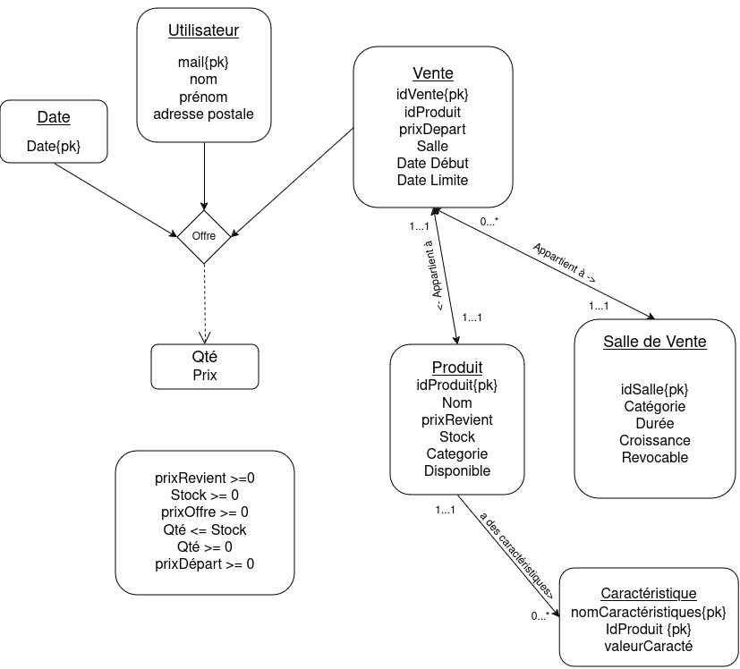

# Documentation du Projet

*Auteur : Yasmine Maabout, Victor Leconte, Lou Couston, Leila Zeroual, Nathan Amelot* 


## Présentation du Projet BDD

### Contexte
La société **Baie-électronique** souhaite moderniser son service de ventes aux enchères en développant une application de gestion basée sur une base de données relationnelle. L'objectif principal est de fournir une plateforme où les utilisateurs peuvent mettre en vente, acheter ou enchérir sur des produits, tout en respectant différents types de ventes (montantes, descendantes, etc.).

### Objectifs
1. Concevoir un schéma Entités/Associations 
2. Implantation de la base de données
3. Développer des transactions SQL pour gérer les principales fonctionnalités, notamment :
   - La création de salles de vente avec sélection de produits et type de ventes.
   - La gestion des enchères effectuées par les utilisateurs.
   - La clôture des ventes et la détermination des gagnants.
4. Programmer une application Java permettant de tester les fonctionnalités.
5. Elaborer une documentation au fur et à mesure du projet. 

### Enjeux
1. Répondre au cahier des charges.
2. Elaboration du diagrame UML correct.
3. Travailer efficacement en équipe avec peu de temps. 
4. Créer une interface java pour l'utilisateur 

---

## Analyse Statique 

Pour l'analyse, nous avons travailler à trois (pendant que les deux autres commencaient la partie JDBC). Après lecture du sujet nous avons determiné comment étaient définie chaques parties. 

Une salle de vente est définie par les éléments suivants :  
  
   - Identifiant unique 
   - Catégorie de produit
   - Type d'offre
   - Sélection de produit 

Une vente est définie par les éléments suivants :  
  
- Identifiant unique 
- Salle de vente 
- Produit unique
- Durée

Un produit est caractérisé par les éléments suivants :  
  
- Identifiant unique
- Nom
- Prix de revient
- Stock proposé
- Description

Une catégorie de produit est définie par les éléments suivants :  
  
- Nom
- Description

Un utilisateur est identifié par les éléments suivants :  
  
- Adresse email
- Nom et prénom
- Adresse postale

Une offre est définie par les éléments suivants :  
  
-  Vente
-  Prix d'achat
-  date 
-  quantité


## Conception Entités/Associations
### Modèle conceptuel




### Description des entités
Dans le diagrame UML les entitées présentes sont  :

- **Date** : correspond à la date à laquelle une offre a été émise 
- **Utilisateur** : correspond au compte l'utisateur
- **Vente** : correspond à la modalité de la vente d'un produit
- **Salle de vente** : correspond à une salle et son type 
- **Produit** : correspond au produit et ses paramêtres
- **Caracteristique** : sous entité de *Produit* donnant ses caractéristiques

Pour éviter la redondance de concept, nous définissons les offres comme des dépendances ternaire entre une date, un utilisateur et une vente. 

### Relations

- **Salle de Vente  $\rightarrow$ Vente** : Une salle de vente peut avoir plusieurs ventes. La cardinalité est **0:N** (Une salle de vente pour plusieurs ventes).

- **Vente  $\rightarrow$ Salle de Vente** : Une vente ne doit appartenir qu'à une seule salle de vente. La cardinalité est **1:1**
  
- **Vente $\Leftrightarrow$ Produit**  : Chaque vente est associée à un produit et un produit est associée à une vente. La cardinalité est **1:1**.

- **Vente  $\rightarrow$ Offre** : Une vente peut avoir plusieurs offres, mais chaque offre correspond à une seule vente. La cardinalité est **0:N** (Une vente peut recevoir plusieurs offres).

- **Offre  $\rightarrow$ Vente** : Une offre correspond à une seule vente. La cardinalité est **1:1** (une offre correspond à une vente).

- **Utilisateur  $\rightarrow$ Offre** : Un utilisateur peut faire plusieurs offres. La cardinalité est **0:N** (Un utilisateur peut faire plusieurs offres).

- **Offre  $\rightarrow$ Utilisateur** : Une offre est faite par un seul utilisateur. La cardinalité est **1:1** (Un utilisateur peut faire plusieurs offres).

- **Produit  $\rightarrow$ Caractéristique** : Un produit peut avoir plusieurs caractéristiques, mais chaque caractéristique appartient à un seul produit. La cardinalité est **0:N** (Un produit peut avoir plusieurs caractéristiques).

- **Caractéristique  $\rightarrow$ Produit** : Une caractéristique appartient à un seul produit. La cardinalité est **1:1** (Un produit peut avoir plusieurs caractéristiques).

- **Date $\Leftrightarrow$ Offre** : on part du principe que la date est très précise donc une date a une seule offre. La cardinalité est **1:1**

---

### Contraintes de valeur

Après la lecture du sujet on détermine des contraintes de valeur triviales : 

- Le **prix de revient** doit forcement être positif
- Le **stock** doit forcement être positif
- Le **prix d'une offre** doit forcement être positif
- La **quantité dans une offre** doit forcement inférieur au **stock**
- La **quantité** doit forcement être positif
- Le **prix de déprat** doit forcement être positif


## Traduction en relationnel

### Relations et attributs

- **idProduit** $\rightarrow$ nom,prixRevient, stock, categorie, disponible
- **Email** $\rightarrow$ Prénom, Nom, Adresse 
- **idSalle** $\rightarrow$ categorie, durre, croissance, revocable
- **nomCaractéristique, idProduit** $\rightarrow$ valeurCaracteristique
- **idVente** $\rightarrow$ idProduit, PrixDepart, idSalle, DateDebut, DateLimite
- **date, idVente, email** $\rightarrow$ Prix ,Quantite 


### Normalisation
- **Salle de Vente** : La relation est en **1NF**, car tous les attributs sont atomiques et en **2NF** puisque chaque attribut non-primaire dépend entièrement de la clé primaire `idSalle`. Elle est en **3NF**, car il n'y a pas de dépendance transitive.

- **Vente** : La relation est en **3NF**. Les attributs `idVente`, `idProduit`, `idSalle` sont clés primaires et tous les autres attributs dépendent de cette clé.

- **Produit** : La relation est en **3NF**. Chaque attribut dépend directement de `idProduit`, sans dépendance transitive.

- **Offre** : La relation est en **3NF**. La clé primaire composée de `(DateOffre, Email, IdVente)` garantit qu'aucune dépendance transitive n'existe.

- **Caractéristique** : La relation est en **3NF**. La clé primaire `(idProduit, nomCaracteristique)` garantit la dépendance de valeurCaractéristique.

## Implémentation de la BDD 


Le code creationTable.sql permet de créer les différentes tables.

La base de donnée est composée de six tables. Les tables et leurs attributs sont les suivantes : 

La table SalledeVente possède les attributs suivants :  
  
- idSalle *(entier non nul)* **clé primaire** 
- Categorie *(chaine de 30 caractères)*
- Duree *(entier)*
- Croissance *(entier)*
- Revocable *(entier)*

La table Vente possède les attributs suivants : 
  
- idVente *(entier non nul)* **clé primaire**
- idProduit *(entier non nul)* **clé étrangère**
- PrixDepart *(entier)*
- idSalle *(entier non nul)* **clé étrangère**
- DateDebut *(entier)* 
- DateLimite *(entier)*

La table Offre possède les attributs suivants : 
- DateOffre *(entier non nul)* **clé primaire**
- IdVente *(entier non nul)* **clé primaire**
- Prix *(entier)* 
- Quantite *(entier non nul)* 

La table Produits possède les attributs suivants : 
  
- idProduit *(entier non nul)* **clé primaire**
- Nom *(chaine de 30 caractères)*
- PrixRevient *(entier)*
- Stock *(entier)*
- categorie *(chaine de 30 caractères)*
- Disponible *(entier)*

La table Users possède les attributs suivants : 
  
- email *(chaine de 50 caractères non nul)* **clé primaire**
- nom *(chaine de 30 caractères)*
- prenom *(chaine de 30 caractères)*
- adresse *(chaine de 50 caractères)*

La table Caracteristiques possède les attributs suivants :  
  
- nomCaracteristique *(chaine de 30 caractères non nul)* **clé primaire**
- idProduit *(entier non nul)* **clé étrangère**
- valeurCaracteristique (int) **clé primaire** 


## Implémentation Java de l'interface 

On part du principe que la base de donnée n'a pas d'offre, de vente et de salle de vente mais elle est peuplée de produits et d'utilisateurs. Ainsi dès la première utilisation il faut commencer par créer une salle de vente.  

Pour gérer le temps en situation de simulation nous avons fait plusieurs choix pour accélerer :
- c'est seulement au bout de 1 minute (au lieu de 10) depuis la dernière offre que la vente est cloturée
- lors d'une vente descendante, le prix baisse de 1% toutes les 6 secondes

L'interface propose 4 possibilités :

1. Créer une salle de vente
2. Ajouter une enchère
3. Rechercher un gagnant 
4. Quitter l'interface

Pour chaque intéraction avec la bdd, si un paramètre est non valide, on ne commit pas et on rollback 

#### Créer une salle de vente 

On nous propose d'abord les différentes catégories disponibles puis les différentes possibilités de vente. La salle est ensuite crée avec la commande :

```sql
BEGIN INSERT INTO SalleDeVente (categorie, croissance, duree) " + "VALUES 
   (?, ?, ?) RETURNING IDSalle INTO ?; END; 
```

On recupère ensuite les produits à mettre en vente avec  

```sql
SELECT idProduit, nom, prixRevient, stock FROM Produits WHERE categorie ?
   AND stock > 0 AND disponible = 1
```
  
On crée une vente avec : 
```sql
INSERT INTO Vente (idSalle, idProduit, prixDepart,dateLimite,dateDebut) 
   VALUES   (?, ?, ?,?,?)
```

On vérifie que les produits sont toujours disponibles, sinon on rollback et on indique à l'utilisateur que les produits n'étaient en fait pas disponibles. (par exemple dans le cas de deux transactions parallèles, si deux personnes essayent presque en même temps de créer une salle avec les mêmes produits)

``` java
if (disponible == 0) {
   // Si les produits sont pas disponibles, on rollback
   conn.rollback();
   System.out.println("Produit non disponible, transaction annulée.");
   return; 
}
```
On oublie pas d'update avant de commit avec : 
```sql
UPDATE Produits SET disponible = 0 WHERE idProduit = ?
```

On commit. 

### Ajouter une enchère 

On récupère tous les utilisateurs :
```sql
SELECT DISTINCT email FROM utilisateur
```

On récupère les ventes : 
```sql
SELECT v.idVente, p.nom AS nomProduit FROM Vente v 
   JOIN Produits p ON v.idProduit = p.idProduit
```

On récupère le produit avec l'idVente donné pour verifier le stock et si la date n'est pas dépassée
```sql
SELECT idProduit FROM Vente WHERE idVente = ?
```
On récupère l'enchère la plus haute pour faire enchérir l'utilisateur.
```sql
SELECT MAX(prix) FROM Offre WHERE idVente = ?
```
On crée une offre si le prix est correct (en fonction du type d'offre)
```sql
INSERT INTO Offre (email, idVente, dateoffre, quantite, prix,time)                 
On commit ensuite.

### Rechercher un gagnant 

On récupère les ventes créée avec : 
```sql
SELECT v.idVente, p.nom AS nomProduit FROM Vente v
   JOIN Produits p ON v.idProduit = p.idProduit
```
On récupère la vente choisit et son type d'offre
```sql
SELECT idProduit FROM Vente WHERE idVente = ?
SELECT revocable, duree, croissance FROM SalleDeVente 
        WHERE idSalle = (SELECT idSalle FROM Vente WHERE idVente = ?)
```
On regarde l'offre gagnante en fonction du type. 

On retire la vente en question
```sql
DELETE FROM Offre WHERE idVente = ?
DELETE FROM Vente WHERE idVente = ?
```
on commit. 

## Conclusion 

Nous sommes satisfaits de notre implémentation, qui respecte le cahier des charges. Nous reconnaissons que, pour une application d'enchères réelle, d'autres fonctionnalités pourraient être ajoutées.  

Le projet nous a permis de développer nos compétences techniques (Java, SQL) ainsi que des compétences transversales comme la gestion des tâches en groupe. Malgré quelques ajustements en cours de route, la répartition des tâches a globalement bien fonctionné.  

